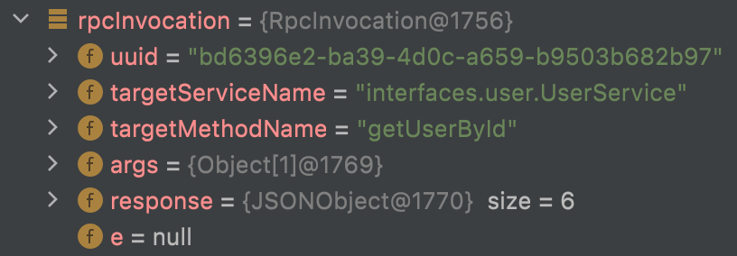

## 进度

### 1. 搭网络框架
- 动态代理使用的是jdk，计划也将cglib动态代理加入

### 2. 结合多个序列化框架


### 

## 遇见的问题
### 1. 序列化问题  
- 问题描述：当接口返回一个对象时，客户端通过RPC请求服务端的该接口，报类型转换错误

```
com.alibaba.fastjson.JSONObject cannot be cast to bean.User
```

- 分析

查看服务端ServerHandler代码：

```java
ServerHandler.java
  
public void channelRead(ChannelHandlerContext ctx, Object msg) throws Exception {
    ...
    rpcInvocation.setResponse(result);
    RpcProtocol respRpcProtocol = new RpcProtocol(JSON.toJSONString(rpcInvocation).getBytes());
    ctx.writeAndFlush(respRpcProtocol);
}
```

从上面代码可以看到，服务端会使用fastjson序列化rpcInvocation对象

再看客户端ClientHandler代码：

```java
ClientHandler.java

public void channelRead(ChannelHandlerContext ctx, Object msg) throws Exception {
    RpcProtocol rpcProtocol = (RpcProtocol) msg;
    byte[] responseContent = rpcProtocol.getContent();
    String json = new String(responseContent, 0, responseContent.length);
    RpcInvocation rpcInvocation = JSON.parseObject(json, RpcInvocation.class);
    // 接收到没有记录的uuid，假如已经过期，则会从RESP_MAP中删除uuid，这里自然也会抛出异常
    if (!RESP_MAP.containsKey(rpcInvocation.getUuid())) {
        throw new IllegalArgumentException("server response is error!");
    }
    RESP_MAP.put(rpcInvocation.getUuid(), rpcInvocation);
    // 查看这里是否成功将引用计数-1
    boolean release = ReferenceCountUtil.release(msg);
    LOGGER.info("释放msg结果：{}", release);
}
```



当我们使用JSON将服务端传过来的json字符串反序列化时，发现其中的response变成了JSONObject，而这种对象不能直接转换成我们需要的User对象

- 解决方法

由于我们是使用jdk动态代理来封装RPC请求的发送，因此实际执行代码在JDKClientInvocationHandler.java的invoke方法：

```java
JDKClientInvocationHandler.java

public Object invoke(Object proxy, Method method, Object[] args) throws Throwable {
    ...
            RpcInvocation respRpcInvocation = (RpcInvocation) object;
            if (method.getReturnType().equals(Void.TYPE)) {
                return null;
            }
            Object responseJsonObject = respRpcInvocation.getResponse();

            return JSON.parseObject(JSON.toJSONString(responseJsonObject), method.getReturnType());
        ...
}
```

判断一下方法返回类型，然后单独反序列化成对象即可解决问题。
